# Pembuatan Website E-Commerce Pembelian Paket Data.

## Deskripsi Proyek
Website yang saya buat adalah simulasi user dalam membeli paket data internet yang sederhana menggunakan ReactJS yang terhubung ke api `json-server`. Desain UI dibuat menggunakan **Figma** dan **Ant Design**.

## Waktu Pengerjaan
**Tanggal Mulai:** 30 April 2025, 18:00 WIB
**Tanggal Selesai:** 3 Mei 2025, 09:00 WIB

## Deploy Aplikasi
1. Run json-server dan npmstart

2. Jalankan localhost:3000 dan muncul pada login page
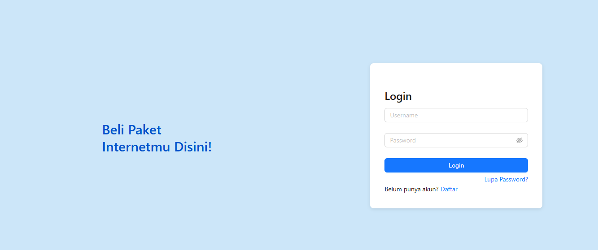

3. Mengecek endpoint yang disediakan json-server
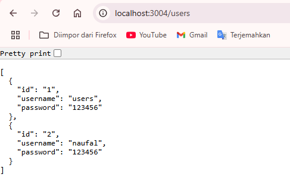

4. Login pada user yang tersedia
Disini nantinya akan login pada user yang tersedia. Ada 2 user yang akan digunakan.

User 1: 
Username: users 
Password: 123456

User 2: 
Username: naufal 
Password: 123456

5. Masuk pada menu riwayat
Menu riwayat berfungsi untuk melihat riwayat transaksi yang sudah dibeli.

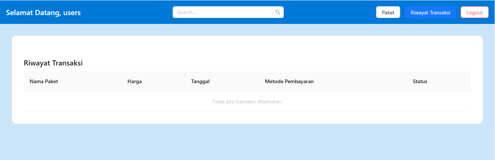

6. Melakukan pembelian paket data dan mengecek riwayat user1
Disini pada akun users akan membeli paket data dan muncul pop-up konfirmasi pembelian.

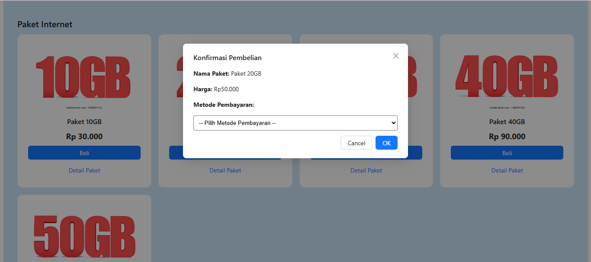

Disini juga muncul metode pembayaran apa saja yang bisa digunakan.
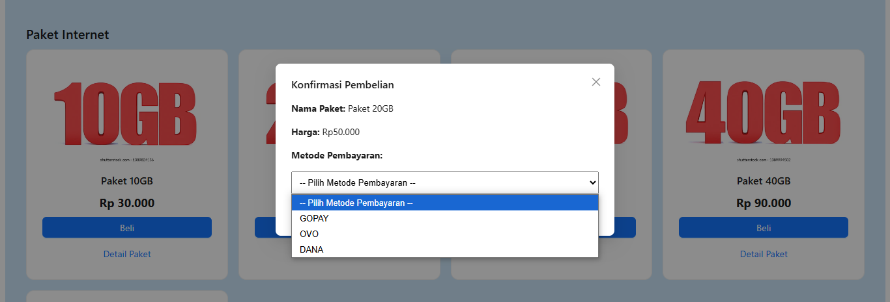

Setelah pembelian sukses, riwayat transaksi akan muncul pada menu riwayat.
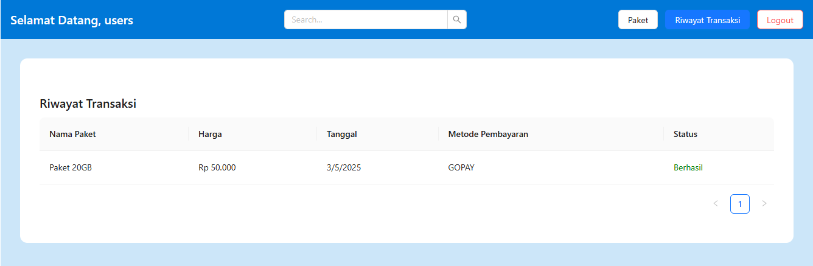

7. Setelah itu melakukan pindah user yang lain
Disini saya pindah dari user1 ke user 2

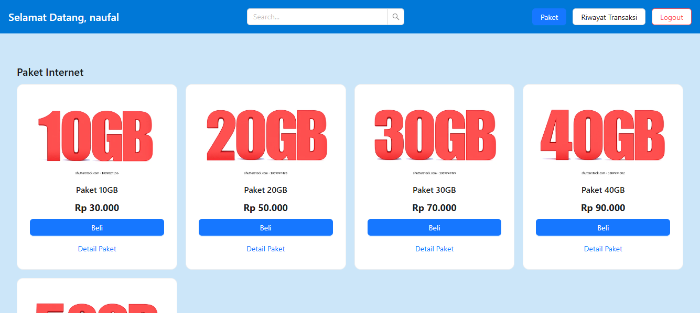

Mengecek riwayat transaksi
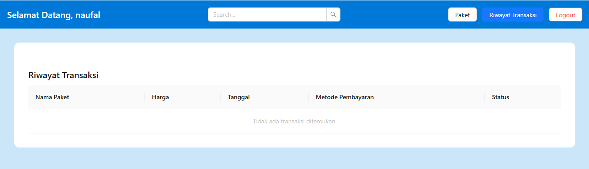

8. Melakukan pembelian paket data dan mengecek riwayat pada user2
Disini pada akun user2 akan melakukan pembelian paket yang berbeda dan muncul pop-up konfirmasi pembelian.

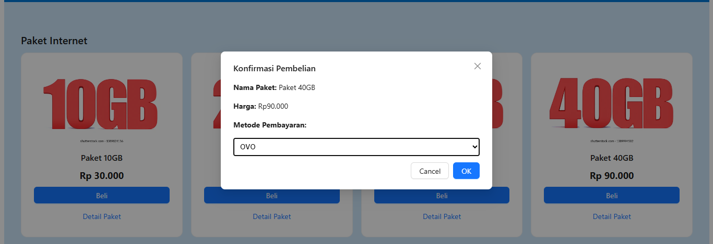

Setelah pembelian sukses, riwayat transaksi akan muncul pada menu riwayat pada user2
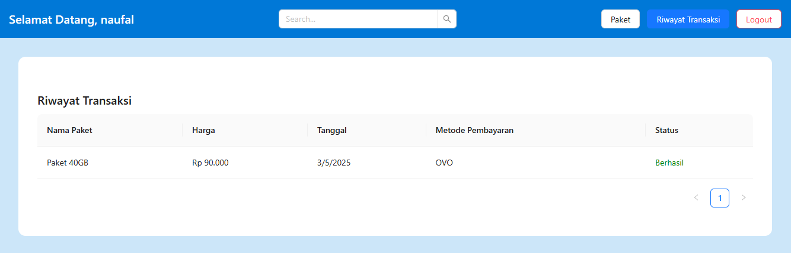

Mencoba membeli paket data lagi, dan melihat riwayat
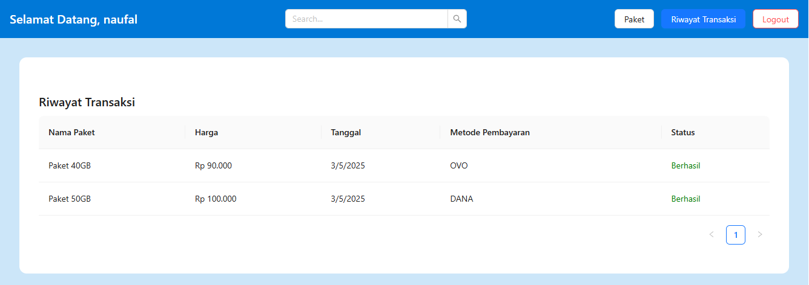

9. Klik Logout dan kembali ke login page.